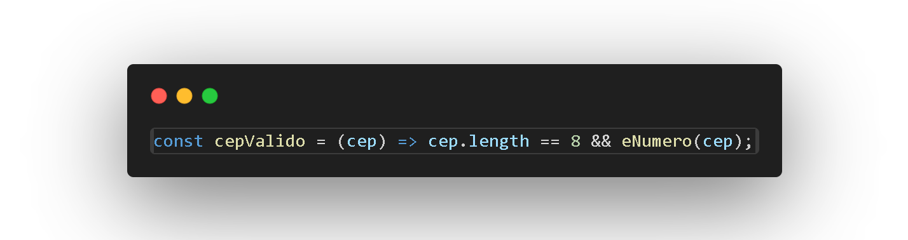
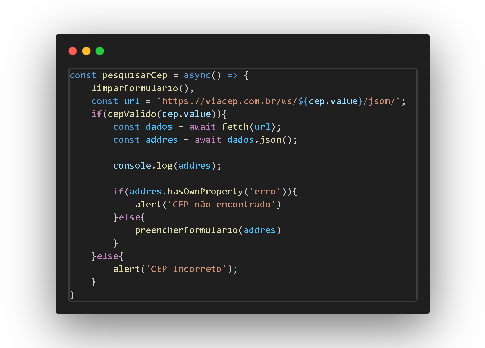

# 

   

# Registration Form 

### Develop an intuitive and efficient registration form, capable of automating the search for address information based on the CEP (Postal Address Code) provided by the user. This functionality will be implemented through integration with an external API specialized in CEP code query, optimizing the registration process and reducing the possibility of typing errors.

# Development

### Searching by CEP code in registration forms is a common practice in several web applications and information systems. However, manually entering address data can be a tedious and error-prone task, which negatively impacts the quality of the data collected. Implementing an automatic zip code query via API offers the following advantages:

 - **Agility:** Automatically filling in address fields speeds up the registration process, providing a better user experience.
 - **Accuracy:** API querying ensures the accuracy of address data, eliminating the need for manual validation and reducing the occurrence of inconsistent information.
 - **Error reduction:** Automating the search by ZIP code reduces the possibility of typing errors, such as incorrect numbers or incorrect street names.
 - **Improving data quality:** Collecting more accurate and consistent data facilitates the analysis and processing of information, optimizing decision making.

# Construction

### Therefore, for the proper construction of this CEP registration form, several functions were created in which they clean the form, check the size of the CEP sent by the user, consume the API, and last but not least the function that relates the API data to the corresponding fields.  Therefore, the functions mentioned above will be shown below.

#  CEP validation

# 

### This JavaScript code checks whether a given string (stored in the number variable) represents a valid number. In other words, it checks if the string only contains digits from 0 to 9.

# API consumption

# 

### This JavaScript code, in short, queries a CEP Code (Postal Address Code) API to obtain information about an address based on the ZIP code provided by the user.

# Fill in the Fields

### This function aims to take information from an address, which is stored in an object called address, and automatically fill in the fields of an HTML form with this data.

# CEP code size

### This cepValido function is a basic validation for Brazilian CEPs. It checks whether the CEP code has the correct size and whether it is made up only of numbers. This function can be used in forms to ensure that users enter valid CEPs codes.

# Clear Form

### The clearFormulario function is used to reset the fields of a form. It searches for the HTML elements that represent these fields (in this case, the street, neighborhood, city and UF fields) and assigns an empty string to the value of these elements. This has the effect of clearing the fields, preparing them so the user can enter new data.

# Final Result

### The project aims to create a smarter and more intuitive registration form, which uses technology to make users' lives easier and optimize data collection and storage processes. Integration with postal service APIs is presented as an effective solution to achieve these goals.

# Technologies Used

[ViaCep](https://viacep.com.br/) 
[Alura](https://www.alura.com.br/?srsltid=AfmBOor0GEDEMLMLgSHNuV0ooKz1hUMV1XWpdqTrfYDLfyxX_yy-eXBS) 
[Ticiano Filho](https://github.com/TicianoFilho/PesquisaCEP/blob/main/script.js)